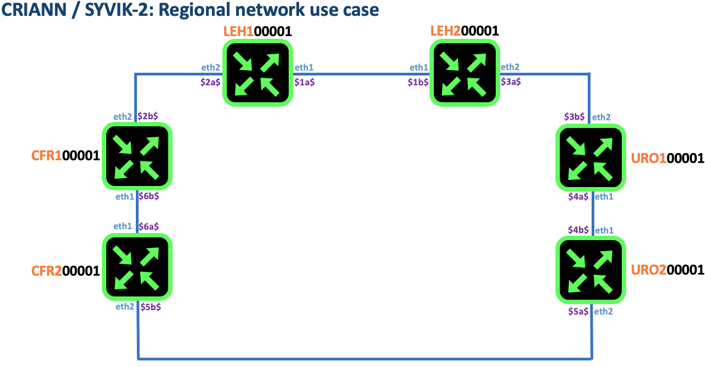

# Metropolitan Area Network use case

## Empty config

```
cd validated-design/000-man/000-run-empty
java -jar ../../rtr.jar test tester criann path ./ temp ./ wait
```
From that point you should have a running lab as depicted in the diagram below

## Diagram


## Verification

* leh100001

```
❯ telnet localhost 20001
Trying 127.0.0.1...
Connected to localhost.
Escape character is '^]'.
welcome
line ready
leh100001#
```

* leh200001

```
telnet localhost 20002
Trying 127.0.0.1...
Connected to localhost.
Escape character is '^]'.
welcome
line ready
leh200001#
```

* uro100001

```
telnet localhost 20003
Trying 127.0.0.1...
Connected to localhost.
Escape character is '^]'.
welcome
line ready
uro100001#
```
* uro200001

```
telnet localhost 20004
Trying 127.0.0.1...
Connected to localhost.
Escape character is '^]'.
welcome
line ready
uro200001#
```
* cfr100001

```
telnet localhost 20005
Trying 127.0.0.1...
Connected to localhost.
Escape character is '^]'.
welcome
line ready
cfr100001#
```
* cfr200001

```
telnet localhost 20006
Trying 127.0.0.1...
Connected to localhost.
Escape character is '^]'.
welcome
line ready
cfr200001#
```
From that point, you are ready to learn freeRtr CLI !

You can continue your networking journey with freeRtr [here](http://docs.freertr.org/guides/getting-started/001-hello-world/)

> PS: The architecture in the [articles](http://docs.freertr.org/guides/getting-started/001-hello-world/) is different from the  Metropolita Area Network use case above. It won't be a cut'n paste experience therefore you'd have to get inspiration from the example and adapt it to the architecture depicted in the [diagram](syvik-2-diagram.png)

