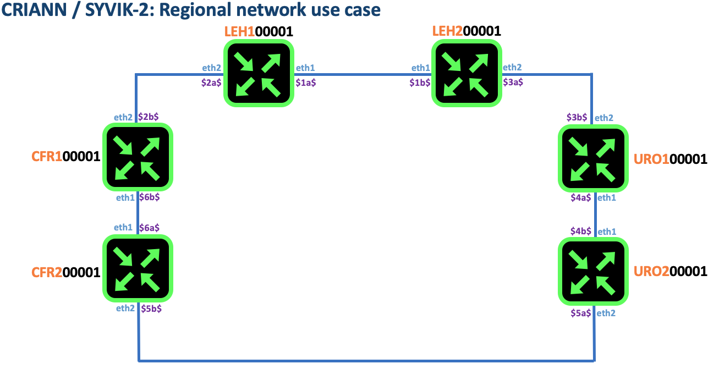

# Metropolitan Area Network use case [interconnect]

## Interconnect config

```
cd validated-design/000-man/001-run-interconnect
java -jar ../../../rtr.jar test tester criann path ./ tmppath ./ wait
```
From that point you should have a running lab as depicted in the diagram below

## Diagram


## Assumptions

### Each router has an id:
`leh100001` has id `1`
`leh200001` has id `2`
`uro100001` has id `3`
`uro200001` has id `4`
`cfr100001` has id `5`
`cfr200001` has id `6`

### interconnect subnet

* IPv4 rule:

Interconnect subnet is 10.0.`id-a``id-b`.[0|1] /31
For example `leh10001` and `leh200001` are interconnected with subnet: `10.0.12.0/31`

* IPv6 rule

Interconnect subnet is fd00:200:971:`id-a``id-b`::[0|1] /31[
For example `leh10001` and `leh200001` are interconnected with subnet: `fd00:200:971:12::/127`

* Node Loopback0 rule:
10.0.0.`id`/32
fd00:200:971::`id`/128

## Verification

* leh100001


```
eh100001#show interfaces description
interface  state  description
loopback0  up     leh100001-id-1
ethernet1  up     leh100001@eth1 -> leh200001@eth1
ethernet2  up     leh100001@eth2 -> cfr200001@eth2

leh100001#show ipv4 interface
interface  state  address    netmask
loopback0  up     10.0.0.1   255.255.255.255
ethernet1  up     10.0.12.0  255.255.255.254
ethernet2  up     10.0.16.0  255.255.255.254

leh100001#show ipv6 interface
interface  state  address            netmask
loopback0  up     fd00:200:971::1    ffff:ffff:ffff:ffff:ffff:ffff:ffff:ffff
ethernet1  up     fd00:200:971:12::  ffff:ffff:ffff:ffff:ffff:ffff:ffff:fffe
ethernet2  up     fd00:200:971:16::  ffff:ffff:ffff:ffff:ffff:ffff:ffff:fffe

leh100001#show lldp neighbor
interface  hostname   iface      ipv4       ipv6
ethernet1  leh200001  ethernet1  10.0.12.1  fd00:200:971:12::1
ethernet2  cfr200001  ethernet2  10.0.16.1  fd00:200:971:16::1

leh100001#ping 10.0.12.1 vrf CORE source ethernet1
pinging 10.0.12.1, src=10.0.12.0, vrf=CORE, cnt=5, len=64, df=false, tim=1000, gap=0, ttl=255, tos=0, sgt=0, flow=0, fill=0, alrt=-1, sweep=false, multi=false
!!!!!
result=100.0%, recv/sent/lost/err=5/5/0/0, took 15, min/avg/max/dev rtt=0/0.2/1/0.1, ttl 255/255/255/0.0, tos 0/0.0/0/0.0

leh100001#ping 10.0.16.1 vrf CORE source ethernet2
pinging 10.0.16.1, src=10.0.16.0, vrf=CORE, cnt=5, len=64, df=false, tim=1000, gap=0, ttl=255, tos=0, sgt=0, flow=0, fill=0, alrt=-1, sweep=false, multi=false
!!!!!
result=100.0%, recv/sent/lost/err=5/5/0/0, took 3, min/avg/max/dev rtt=0/0.5/1/0.2, ttl 255/255/255/0.0, tos 0/0.0/0/0.0

leh100001#ping fd00:200:971:12::1 vrf CORE source ethernet1
pinging fd00:200:971:12::1, src=fd00:200:971:12::, vrf=CORE, cnt=5, len=64, df=false, tim=1000, gap=0, ttl=255, tos=0, sgt=0, flow=0, fill=0, alrt=-1, sweep=false, multi=false
!!!!!
result=100.0%, recv/sent/lost/err=5/5/0/0, took 3, min/avg/max/dev rtt=0/0.6/2/0.6, ttl 255/255/255/0.0, tos 0/0.0/0/0.0

leh100001#ping fd00:200:971:16::1 vrf CORE source ethernet2
pinging fd00:200:971:16::1, src=fd00:200:971:16::, vrf=CORE, cnt=5, len=64, df=false, tim=1000, gap=0, ttl=255, tos=0, sgt=0, flow=0, fill=0, alrt=-1, sweep=false, multi=false
!!!!!
result=100.0%, recv/sent/lost/err=5/5/0/0, took 3, min/avg/max/dev rtt=0/0.6/1/0.2, ttl 255/255/255/0.0, tos 0/0.0/0/0.0
```

* leh200001

```
leh200001#show interfaces description
interface  state  description
loopback0  up     leh200001-id-2
ethernet1  up     leh200001@eth1 -> leh100001@eth1
ethernet2  up     leh200001@eth2 -> uro100001@eth2

leh200001#show ipv4 interface
interface  state  address    netmask
loopback0  up     10.0.0.2   255.255.255.255
ethernet1  up     10.0.12.1  255.255.255.254
ethernet2  up     10.0.23.0  255.255.255.254

leh200001#show ipv6 interface
interface  state  address             netmask
loopback0  up     fd00:200:971::2     ffff:ffff:ffff:ffff:ffff:ffff:ffff:ffff
ethernet1  up     fd00:200:971:12::1  ffff:ffff:ffff:ffff:ffff:ffff:ffff:fffe
ethernet2  up     fd00:200:971:23::   ffff:ffff:ffff:ffff:ffff:ffff:ffff:fffe

leh200001#show lldp neighbor
interface  hostname   iface      ipv4       ipv6
ethernet1  leh100001  ethernet1  10.0.12.0  fd00:200:971:12::
ethernet2  uro100001  ethernet2  10.0.23.1  fd00:200:971:23::1

leh200001#ping 10.0.12.0 vrf CORE source ethernet1
pinging 10.0.12.0, src=10.0.12.1, vrf=CORE, cnt=5, len=64, df=false, tim=1000, gap=0, ttl=255, tos=0, sgt=0, flow=0, fill=0, alrt=-1, sweep=false, multi=false
!!!!!
result=100.0%, recv/sent/lost/err=5/5/0/0, took 15, min/avg/max/dev rtt=0/0.4/1/0.2, ttl 255/255/255/0.0, tos 0/0.0/0/0.0

leh200001#ping 10.0.23.1 vrf CORE source ethernet2
pinging 10.0.23.1, src=10.0.23.0, vrf=CORE, cnt=5, len=64, df=false, tim=1000, gap=0, ttl=255, tos=0, sgt=0, flow=0, fill=0, alrt=-1, sweep=false, multi=false
!!!!!
result=100.0%, recv/sent/lost/err=5/5/0/0, took 2, min/avg/max/dev rtt=0/0.4/1/0.2, ttl 255/255/255/0.0, tos 0/0.0/0/0.0

leh200001#ping fd00:200:971:12:: vrf CORE source ethernet1
pinging fd00:200:971:12::, src=fd00:200:971:12::1, vrf=CORE, cnt=5, len=64, df=false, tim=1000, gap=0, ttl=255, tos=0, sgt=0, flow=0, fill=0, alrt=-1, sweep=false, multi=false
!!!!!
result=100.0%, recv/sent/lost/err=5/5/0/0, took 1, min/avg/max/dev rtt=0/0.1/1/0.1, ttl 255/255/255/0.0, tos 0/0.0/0/0.0

leh200001#ping fd00:200:971:23::1 vrf CORE source ethernet2
pinging fd00:200:971:23::1, src=fd00:200:971:23::, vrf=CORE, cnt=5, len=64, df=false, tim=1000, gap=0, ttl=255, tos=0, sgt=0, flow=0, fill=0, alrt=-1, sweep=false, multi=false
!!!!!
result=100.0%, recv/sent/lost/err=5/5/0/0, took 2, min/avg/max/dev rtt=0/0.2/1/0.1, ttl 255/255/255/0.0, tos 0/0.0/0/0.0
```

* uro100001

```
uro100001#show interfaces description
interface  state  description
loopback0  up     uro100001-id-3
ethernet1  up     uro100001@eth1 -> uro200001@eth1
ethernet2  up     uro100001@eth2 -> leh200001@eth2

uro100001#show ipv4 interface
interface  state  address    netmask
loopback0  up     10.0.0.3   255.255.255.255
ethernet1  up     10.0.34.0  255.255.255.254
ethernet2  up     10.0.23.1  255.255.255.254

uro100001#show ipv6 interface
interface  state  address             netmask
loopback0  up     fd00:200:971::3     ffff:ffff:ffff:ffff:ffff:ffff:ffff:ffff
ethernet1  up     fd00:200:971:34::   ffff:ffff:ffff:ffff:ffff:ffff:ffff:fffe
ethernet2  up     fd00:200:971:23::1  ffff:ffff:ffff:ffff:ffff:ffff:ffff:fffe

uro100001#show lldp neighbor
interface  hostname   iface      ipv4       ipv6
ethernet1  uro200001  ethernet1  10.0.34.1  fd00:200:971:34::1
ethernet2  leh200001  ethernet2  10.0.23.0  fd00:200:971:23::

uro100001#ping 10.0.34.1 vrf CORE source ethernet1
pinging 10.0.34.1, src=10.0.34.0, vrf=CORE, cnt=5, len=64, df=false, tim=1000, gap=0, ttl=255, tos=0, sgt=0, flow=0, fill=0, alrt=-1, sweep=false, multi=false
!!!!!
result=100.0%, recv/sent/lost/err=5/5/0/0, took 18, min/avg/max/dev rtt=0/0.4/1/0.2, ttl 255/255/255/0.0, tos 0/0.0/0/0.0

uro100001#ping 10.0.23.0 vrf CORE source ethernet2
pinging 10.0.23.0, src=10.0.23.1, vrf=CORE, cnt=5, len=64, df=false, tim=1000, gap=0, ttl=255, tos=0, sgt=0, flow=0, fill=0, alrt=-1, sweep=false, multi=false
!!!!!
result=100.0%, recv/sent/lost/err=5/5/0/0, took 2, min/avg/max/dev rtt=0/0.4/1/0.2, ttl 255/255/255/0.0, tos 0/0.0/0/0.0

uro100001#ping fd00:200:971:34::1 vrf CORE source ethernet1
pinging fd00:200:971:34::1, src=fd00:200:971:34::, vrf=CORE, cnt=5, len=64, df=false, tim=1000, gap=0, ttl=255, tos=0, sgt=0, flow=0, fill=0, alrt=-1, sweep=false, multi=false
!!!!!
result=100.0%, recv/sent/lost/err=5/5/0/0, took 2, min/avg/max/dev rtt=0/0.3/1/0.2, ttl 255/255/255/0.0, tos 0/0.0/0/0.0

uro100001#ping fd00:200:971:23:: vrf CORE source ethernet2
pinging fd00:200:971:23::, src=fd00:200:971:23::1, vrf=CORE, cnt=5, len=64, df=false, tim=1000, gap=0, ttl=255, tos=0, sgt=0, flow=0, fill=0, alrt=-1, sweep=false, multi=false
!!!!!
result=100.0%, recv/sent/lost/err=5/5/0/0, took 2, min/avg/max/dev rtt=0/0.4/1/0.2, ttl 255/255/255/0.0, tos 0/0.0/0/0.0
```
* uro200001

```
uro200001#show interfaces description
interface  state  description
loopback0  up     uro200001-id-4
ethernet1  up     uro200001@eth1 -> uro100001@eth1
ethernet2  up     uro200001@eth2 -> cfr100001@eth2

uro200001#show ipv4 interface
interface  state  address    netmask
loopback0  up     10.0.0.4   255.255.255.255
ethernet1  up     10.0.34.1  255.255.255.254
ethernet2  up     10.0.45.0  255.255.255.254

uro200001#show ipv6 interface
interface  state  address             netmask
loopback0  up     fd00:200:971::4     ffff:ffff:ffff:ffff:ffff:ffff:ffff:ffff
ethernet1  up     fd00:200:971:34::1  ffff:ffff:ffff:ffff:ffff:ffff:ffff:fffe
ethernet2  up     fd00:200:971:45::   ffff:ffff:ffff:ffff:ffff:ffff:ffff:fffe

uro200001#show lldp neighbor
interface  hostname   iface      ipv4       ipv6
ethernet1  uro100001  ethernet1  10.0.34.0  fd00:200:971:34::
ethernet2  cfr100001  ethernet2  10.0.45.1  fd00:200:971:45::1

uro200001#ping 10.0.34.0 vrf CORE source ethernet1
pinging 10.0.34.0, src=10.0.34.1, vrf=CORE, cnt=5, len=64, df=false, tim=1000, gap=0, ttl=255, tos=0, sgt=0, flow=0, fill=0, alrt=-1, sweep=false, multi=false
!!!!!
result=100.0%, recv/sent/lost/err=5/5/0/0, took 3, min/avg/max/dev rtt=0/0.5/1/0.2, ttl 255/255/255/0.0, tos 0/0.0/0/0.0

uro200001#ping 10.0.45.1 vrf CORE source ethernet2
pinging 10.0.45.1, src=10.0.45.0, vrf=CORE, cnt=5, len=64, df=false, tim=1000, gap=0, ttl=255, tos=0, sgt=0, flow=0, fill=0, alrt=-1, sweep=false, multi=false
!!!!!
result=100.0%, recv/sent/lost/err=5/5/0/0, took 2, min/avg/max/dev rtt=0/0.4/1/0.2, ttl 255/255/255/0.0, tos 0/0.0/0/0.0

uro200001#ping fd00:200:971:34:: vrf CORE source ethernet1
pinging fd00:200:971:34::, src=fd00:200:971:34::1, vrf=CORE, cnt=5, len=64, df=false, tim=1000, gap=0, ttl=255, tos=0, sgt=0, flow=0, fill=0, alrt=-1, sweep=false, multi=false
!!!!!
result=100.0%, recv/sent/lost/err=5/5/0/0, took 2, min/avg/max/dev rtt=0/0.4/1/0.2, ttl 255/255/255/0.0, tos 0/0.0/0/0.0

uro200001#ping fd00:200:971:45::1 vrf CORE source ethernet2
pinging fd00:200:971:45::1, src=fd00:200:971:45::, vrf=CORE, cnt=5, len=64, df=false, tim=1000, gap=0, ttl=255, tos=0, sgt=0, flow=0, fill=0, alrt=-1, sweep=false, multi=false
!!!!!
result=100.0%, recv/sent/lost/err=5/5/0/0, took 2, min/avg/max/dev rtt=0/0.4/1/0.2, ttl 255/255/255/0.0, tos 0/0.0/0/0.0
```
* cfr100001

```
cfr100001#show interfaces description
interface  state  description
loopback0  up     cfr100001-id-5
ethernet1  up     cfr100001@eth1 -> cfr200001@eth1
ethernet2  up     cfr100001@eth2 -> uro200001@eth2

cfr100001#show ipv4 interface
interface  state  address    netmask
loopback0  up     10.0.0.5   255.255.255.255
ethernet1  up     10.0.56.0  255.255.255.254
ethernet2  up     10.0.45.1  255.255.255.254

cfr100001#show ipv6 interface
interface  state  address             netmask
loopback0  up     fd00:200:971::5     ffff:ffff:ffff:ffff:ffff:ffff:ffff:ffff
ethernet1  up     fd00:200:971:56::   ffff:ffff:ffff:ffff:ffff:ffff:ffff:fffe
ethernet2  up     fd00:200:971:45::1  ffff:ffff:ffff:ffff:ffff:ffff:ffff:fffe

cfr100001#show lldp
incomplete command, try show lldp ?

cfr100001#show lldp neighbor
interface  hostname   iface      ipv4       ipv6
ethernet1  cfr200001  ethernet1  10.0.56.1  fd00:200:971:56::1
ethernet2  uro200001  ethernet2  10.0.45.0  fd00:200:971:45::

cfr100001#ping 10.0.56.1 vrf CORE source ethernet1
pinging 10.0.56.1, src=10.0.56.0, vrf=CORE, cnt=5, len=64, df=false, tim=1000, gap=0, ttl=255, tos=0, sgt=0, flow=0, fill=0, alrt=-1, sweep=false, multi=false
!!!!!
result=100.0%, recv/sent/lost/err=5/5/0/0, took 2, min/avg/max/dev rtt=0/0.1/1/0.1, ttl 255/255/255/0.0, tos 0/0.0/0/0.0

cfr100001#ping 10.0.45.0 vrf CORE source ethernet2
pinging 10.0.45.0, src=10.0.45.1, vrf=CORE, cnt=5, len=64, df=false, tim=1000, gap=0, ttl=255, tos=0, sgt=0, flow=0, fill=0, alrt=-1, sweep=false, multi=false
!!!!!
result=100.0%, recv/sent/lost/err=5/5/0/0, took 2, min/avg/max/dev rtt=0/0.4/1/0.2, ttl 255/255/255/0.0, tos 0/0.0/0/0.0

cfr100001#ping fd00:200:971:56::1 vrf CORE source ethernet1
pinging fd00:200:971:56::1, src=fd00:200:971:56::, vrf=CORE, cnt=5, len=64, df=false, tim=1000, gap=0, ttl=255, tos=0, sgt=0, flow=0, fill=0, alrt=-1, sweep=false, multi=false
!!!!!
result=100.0%, recv/sent/lost/err=5/5/0/0, took 2, min/avg/max/dev rtt=0/0.4/1/0.2, ttl 255/255/255/0.0, tos 0/0.0/0/0.0

cfr100001#ping fd00:200:971:45:: vrf CORE source ethernet2
pinging fd00:200:971:45::, src=fd00:200:971:45::1, vrf=CORE, cnt=5, len=64, df=false, tim=1000, gap=0, ttl=255, tos=0, sgt=0, flow=0, fill=0, alrt=-1, sweep=false, multi=false
!!!!!
result=100.0%, recv/sent/lost/err=5/5/0/0, took 2, min/avg/max/dev rtt=0/0.4/1/0.2, ttl 255/255/255/0.0, tos 0/0.0/0/0.0
```
* cfr200001

```
cfr200001#show interfaces description
interface  state  description
loopback0  up     cfr200001-id-6
ethernet1  up     cfr200001@eth1 -> cfr100001@eth1
ethernet2  up     cfr200001@eth2 -> leh100001@eth2

cfr200001#show ipv4 interface
interface  state  address    netmask
loopback0  up     10.0.0.6   255.255.255.255
ethernet1  up     10.0.56.1  255.255.255.254
ethernet2  up     10.0.16.1  255.255.255.254

cfr200001#show ipv6 interface
interface  state  address             netmask
loopback0  up     fd00:200:971::6     ffff:ffff:ffff:ffff:ffff:ffff:ffff:ffff
ethernet1  up     fd00:200:971:56::1  ffff:ffff:ffff:ffff:ffff:ffff:ffff:fffe
ethernet2  up     fd00:200:971:16::1  ffff:ffff:ffff:ffff:ffff:ffff:ffff:fffe

cfr200001#show lldp neighbor
interface  hostname   iface      ipv4       ipv6
ethernet1  cfr100001  ethernet1  10.0.56.0  fd00:200:971:56::
ethernet2  leh100001  ethernet2  10.0.16.0  fd00:200:971:16::

cfr200001#ping 10.0.56.0 vrf CORE source ethernet1
pinging 10.0.56.0, src=10.0.56.1, vrf=CORE, cnt=5, len=64, df=false, tim=1000, gap=0, ttl=255, tos=0, sgt=0, flow=0, fill=0, alrt=-1, sweep=false, multi=false
!!!!!
result=100.0%, recv/sent/lost/err=5/5/0/0, took 20, min/avg/max/dev rtt=0/0.4/1/0.2, ttl 255/255/255/0.0, tos 0/0.0/0/0.0

cfr200001#ping 10.0.16.0 vrf CORE source ethernet2
pinging 10.0.16.0, src=10.0.16.1, vrf=CORE, cnt=5, len=64, df=false, tim=1000, gap=0, ttl=255, tos=0, sgt=0, flow=0, fill=0, alrt=-1, sweep=false, multi=false
!!!!!
result=100.0%, recv/sent/lost/err=5/5/0/0, took 2, min/avg/max/dev rtt=0/0.2/1/0.1, ttl 255/255/255/0.0, tos 0/0.0/0/0.0

cfr200001#ping fd00:200:971:56:: vrf CORE source ethernet1
pinging fd00:200:971:56::, src=fd00:200:971:56::1, vrf=CORE, cnt=5, len=64, df=false, tim=1000, gap=0, ttl=255, tos=0, sgt=0, flow=0, fill=0, alrt=-1, sweep=false, multi=false
!!!!!
result=100.0%, recv/sent/lost/err=5/5/0/0, took 3, min/avg/max/dev rtt=0/0.3/1/0.2, ttl 255/255/255/0.0, tos 0/0.0/0/0.0

cfr200001#ping fd00:200:971:16:: vrf CORE source ethernet2
pinging fd00:200:971:16::, src=fd00:200:971:16::1, vrf=CORE, cnt=5, len=64, df=false, tim=1000, gap=0, ttl=255, tos=0, sgt=0, flow=0, fill=0, alrt=-1, sweep=false, multi=false
!!!!!
result=100.0%, recv/sent/lost/err=5/5/0/0, took 2, min/avg/max/dev rtt=0/0.3/1/0.2, ttl 255/255/255/0.0, tos 0/0.0/0/0.0
cfr200001#

```

## Where to go next ...
Congratulations ! Now you should get a MAN with core network links configured enabling IPv4 and IPv6 connectivity. Next step is to enable an Interior Gateway Protocol.
