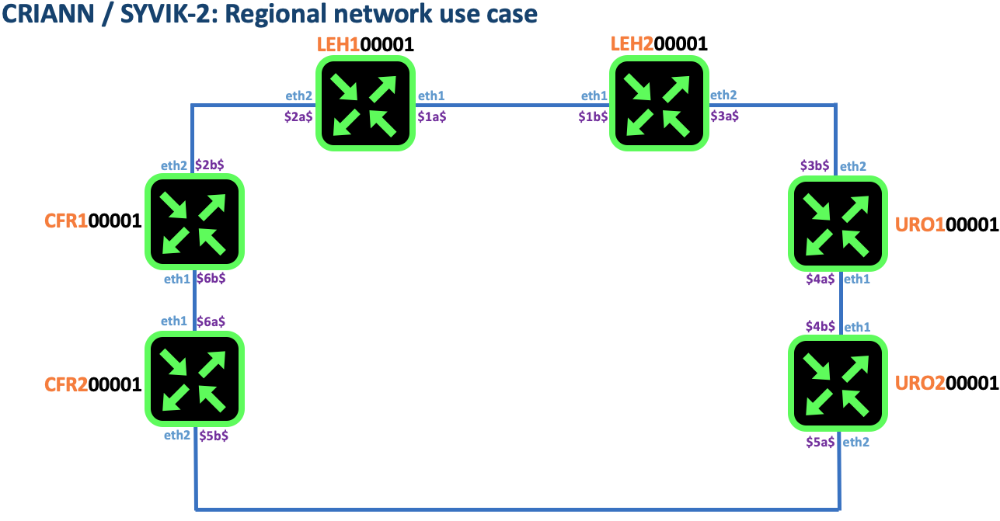

# Metropolitan Area Network use case [isis-ldp]

## ISIS with LDP4 and LDP6 config

```
cd validated-design/000-man/003-run-isis-ldp
java -jar ../../rtr.jar test tester criann path ./ temp ./ wait
```
From that point you should have a running lab as depicted in the diagram below. This lab inherit from [isis](../002-run-isis)
In the present lab, we will implment MPLS LDP enabled on top of ISIS

## Diagram


## Assumptions

### VRF definition
VRF `CORE` is configured to enabled LDP for IPv4 and IPv6 for Loopback only. This is similar to Junos default behaviour.


## Verification


* leh100001

```
leh100001#show ipv4 ldp CORE summary
prefix         layer2         p2mp
learn  advert  learn  advert  learn  advert  neighbor   uptime
8      8       0      0       0      0       10.0.12.1  00:00:05
8      8       0      0       0      0       10.0.16.1  00:00:10

leh100001#show ipv6 ldp CORE summary
prefix         layer2         p2mp
learn  advert  learn  advert  learn  advert  neighbor            uptime
8      8       0      0       0      0       fd00:200:971:12::1  00:00:15
8      8       0      0       0      0       fd00:200:971:16::1  00:00:14

leh100001#show ipv4 route CORE
typ  prefix        metric  iface      hop        time
C    10.0.0.1/32   0/0     loopback0  null       00:00:54
I    10.0.0.2/32   115/10  ethernet1  10.0.12.1  00:00:44
I    10.0.0.3/32   115/20  ethernet1  10.0.12.1  00:00:44
I    10.0.0.4/32   115/30  ethernet1  10.0.12.1  00:00:44
I    10.0.0.5/32   115/20  ethernet2  10.0.16.1  00:00:53
I    10.0.0.6/32   115/10  ethernet2  10.0.16.1  00:00:53
C    10.0.12.0/31  0/0     ethernet1  null       00:00:54
LOC  10.0.12.0/32  0/1     ethernet1  null       00:00:54
C    10.0.16.0/31  0/0     ethernet2  null       00:00:54
LOC  10.0.16.0/32  0/1     ethernet2  null       00:00:54
I    10.0.23.0/31  115/20  ethernet1  10.0.12.1  00:00:44
I    10.0.34.0/31  115/30  ethernet1  10.0.12.1  00:00:44
I    10.0.45.0/31  115/30  ethernet2  10.0.16.1  00:00:53
I    10.0.56.0/31  115/20  ethernet2  10.0.16.1  00:00:53

leh100001#traceroute 10.0.0.2 vrf CORE source loopback0
tracing 10.0.0.2, src=10.0.0.1, vrf=CORE, prt=0/33440, tim=1000, tos=0, flow=0, len=64
via 10.0.0.2/32 115/10 ethernet1 10.0.12.1 00:01:01
1 10.0.0.2 time=2, mpls=799864
leh100001#traceroute 10.0.0.3 vrf CORE source loopback0
tracing 10.0.0.3, src=10.0.0.1, vrf=CORE, prt=0/33440, tim=1000, tos=0, flow=0, len=64
via 10.0.0.3/32 115/20 ethernet1 10.0.12.1 00:01:07
1 10.0.23.0 time=1, mpls=20412
2 10.0.0.3 time=1, mpls=128616
leh100001#traceroute 10.0.0.4 vrf CORE source loopback0
tracing 10.0.0.4, src=10.0.0.1, vrf=CORE, prt=0/33440, tim=1000, tos=0, flow=0, len=64
via 10.0.0.4/32 115/30 ethernet1 10.0.12.1 00:01:12
1 10.0.23.0 time=1, mpls=406328
2 10.0.34.0 time=1, mpls=637298
3 10.0.0.4 time=1, mpls=673584
leh100001#traceroute 10.0.0.5 vrf CORE source loopback0
tracing 10.0.0.5, src=10.0.0.1, vrf=CORE, prt=0/33440, tim=1000, tos=0, flow=0, len=64
via 10.0.0.5/32 115/20 ethernet2 10.0.16.1 00:01:26
1 10.0.56.1 time=1, mpls=376477
2 10.0.0.5 time=2, mpls=813228
leh100001#traceroute 10.0.0.6 vrf CORE source loopback0
tracing 10.0.0.6, src=10.0.0.1, vrf=CORE, prt=0/33440, tim=1000, tos=0, flow=0, len=64
via 10.0.0.6/32 115/10 ethernet2 10.0.16.1 00:01:31
1 10.0.0.6 time=1, mpls=360102
leh100001#
leh100001#
leh100001#show ipv6 route CORE
typ   prefix                 metric  iface      hop                 time
C     fd00:200:971::1/128    0/0     loopback0  null                00:01:48
I EX  fd00:200:971::2/128    115/10  ethernet1  fd00:200:971:12::1  00:01:37
I EX  fd00:200:971::3/128    115/20  ethernet1  fd00:200:971:12::1  00:01:37
I EX  fd00:200:971::4/128    115/30  ethernet1  fd00:200:971:12::1  00:01:37
I EX  fd00:200:971::5/128    115/20  ethernet2  fd00:200:971:16::1  00:01:47
I EX  fd00:200:971::6/128    115/10  ethernet2  fd00:200:971:16::1  00:01:47
C     fd00:200:971:12::/127  0/0     ethernet1  null                00:01:48
LOC   fd00:200:971:12::/128  0/1     ethernet1  null                00:01:48
C     fd00:200:971:16::/127  0/0     ethernet2  null                00:01:48
LOC   fd00:200:971:16::/128  0/1     ethernet2  null                00:01:48
I     fd00:200:971:23::/127  115/20  ethernet1  fd00:200:971:12::1  00:01:37
I     fd00:200:971:34::/127  115/30  ethernet1  fd00:200:971:12::1  00:01:37
I     fd00:200:971:45::/127  115/30  ethernet2  fd00:200:971:16::1  00:01:47
I     fd00:200:971:56::/127  115/20  ethernet2  fd00:200:971:16::1  00:01:47

leh100001#traceroute fd00:200:971::2 vrf CORE source loopback0
tracing fd00:200:971::2, src=fd00:200:971::1, vrf=CORE, prt=0/33440, tim=1000, tos=0, flow=0, len=64
via fd00:200:971::2/128 115/10 ethernet1 fd00:200:971:12::1 00:01:51
1 fd00:200:971::2 time=1, mpls=890549
leh100001#traceroute fd00:200:971::3 vrf CORE source loopback0
tracing fd00:200:971::3, src=fd00:200:971::1, vrf=CORE, prt=0/33440, tim=1000, tos=0, flow=0, len=64
via fd00:200:971::3/128 115/20 ethernet1 fd00:200:971:12::1 00:01:56
1 fd00:200:971:23:: time=0, mpls=279925
2 fd00:200:971::3 time=1, mpls=958195
leh100001#traceroute fd00:200:971::4 vrf CORE source loopback0
tracing fd00:200:971::4, src=fd00:200:971::1, vrf=CORE, prt=0/33440, tim=1000, tos=0, flow=0, len=64
via fd00:200:971::4/128 115/30 ethernet1 fd00:200:971:12::1 00:02:01
1 fd00:200:971:23:: time=1, mpls=540238
2 fd00:200:971:34:: time=1, mpls=847340
3 fd00:200:971::4 time=1, mpls=229819
leh100001#traceroute fd00:200:971::5 vrf CORE source loopback0
tracing fd00:200:971::5, src=fd00:200:971::1, vrf=CORE, prt=0/33440, tim=1000, tos=0, flow=0, len=64
via fd00:200:971::5/128 115/20 ethernet2 fd00:200:971:16::1 00:02:15
1 fd00:200:971:56::1 time=1, mpls=376263
2 fd00:200:971::5 time=1, mpls=921792
leh100001#traceroute fd00:200:971::6 vrf CORE source loopback0
tracing fd00:200:971::6, src=fd00:200:971::1, vrf=CORE, prt=0/33440, tim=1000, tos=0, flow=0, len=64
via fd00:200:971::6/128 115/10 ethernet2 fd00:200:971:16::1 00:02:19
1 fd00:200:971::6 time=1, mpls=657769
leh100001#
```

* leh200001

```
leh200001#show ipv4 ldp CORE summary
prefix         layer2         p2mp
learn  advert  learn  advert  learn  advert  neighbor   uptime
8      8       0      0       0      0       10.0.12.0  00:03:14
8      8       0      0       0      0       10.0.23.1  00:03:19

leh200001#show ipv6 ldp CORE summary
prefix         layer2         p2mp
learn  advert  learn  advert  learn  advert  neighbor            uptime
8      8       0      0       0      0       fd00:200:971:12::   00:03:23
8      8       0      0       0      0       fd00:200:971:23::1  00:03:23

leh200001#show ipv4 route CORE
typ  prefix        metric  iface      hop        time
I    10.0.0.1/32   115/10  ethernet1  10.0.12.0  00:03:52
C    10.0.0.2/32   0/0     loopback0  null       00:04:03
I    10.0.0.3/32   115/10  ethernet2  10.0.23.1  00:04:02
I    10.0.0.4/32   115/20  ethernet2  10.0.23.1  00:04:02
I    10.0.0.5/32   115/30  ethernet2  10.0.23.1  00:03:59
I    10.0.0.6/32   115/20  ethernet1  10.0.12.0  00:03:52
C    10.0.12.0/31  0/0     ethernet1  null       00:04:03
LOC  10.0.12.1/32  0/1     ethernet1  null       00:04:03
I    10.0.16.0/31  115/20  ethernet1  10.0.12.0  00:03:52
C    10.0.23.0/31  0/0     ethernet2  null       00:04:02
LOC  10.0.23.0/32  0/1     ethernet2  null       00:04:02
I    10.0.34.0/31  115/20  ethernet2  10.0.23.1  00:04:02
I    10.0.45.0/31  115/30  ethernet2  10.0.23.1  00:04:02
I    10.0.56.0/31  115/30  ethernet1  10.0.12.0  00:03:52

leh200001#traceroute 10.0.0.1 vrf CORE source loopback0
tracing 10.0.0.1, src=10.0.0.2, vrf=CORE, prt=0/33440, tim=1000, tos=0, flow=0, len=64
via 10.0.0.1/32 115/10 ethernet1 10.0.12.0 00:04:02
1 10.0.0.1 time=2, mpls=988658
leh200001#traceroute 10.0.0.2 vrf CORE source loopback0
tracing 10.0.0.2, src=10.0.0.2, vrf=CORE, prt=0/33440, tim=1000, tos=0, flow=0, len=64
via 10.0.0.2/32 0/0 loopback0 null 00:04:19
1 10.0.0.2 time=0
leh200001#traceroute 10.0.0.3 vrf CORE source loopback0
tracing 10.0.0.3, src=10.0.0.2, vrf=CORE, prt=0/33440, tim=1000, tos=0, flow=0, len=64
via 10.0.0.3/32 115/10 ethernet2 10.0.23.1 00:04:25
1 10.0.0.3 time=0, mpls=128616
leh200001#traceroute 10.0.0.4 vrf CORE source loopback0
tracing 10.0.0.4, src=10.0.0.2, vrf=CORE, prt=0/33440, tim=1000, tos=0, flow=0, len=64
via 10.0.0.4/32 115/20 ethernet2 10.0.23.1 00:04:30
1 10.0.34.0 time=1, mpls=637298
2 10.0.0.4 time=0, mpls=673584
leh200001#traceroute 10.0.0.5 vrf CORE source loopback0
tracing 10.0.0.5, src=10.0.0.2, vrf=CORE, prt=0/33440, tim=1000, tos=0, flow=0, len=64
via 10.0.0.5/32 115/30 ethernet2 10.0.23.1 00:04:31
1 10.0.34.0 time=1, mpls=731407
2 10.0.45.0 time=1, mpls=680037
3 10.0.0.5 time=1, mpls=813228
leh200001#traceroute 10.0.0.6 vrf CORE source loopback0
tracing 10.0.0.6, src=10.0.0.2, vrf=CORE, prt=0/33440, tim=1000, tos=0, flow=0, len=64
via 10.0.0.6/32 115/20 ethernet1 10.0.12.0 00:04:30
1 10.0.16.0 time=1, mpls=346072
2 10.0.0.6 time=0, mpls=360102
leh200001#show ipv6 route CORE
typ   prefix                  metric  iface      hop                 time
I EX  fd00:200:971::1/128     115/10  ethernet1  fd00:200:971:12::   00:04:40
C     fd00:200:971::2/128     0/0     loopback0  null                00:04:51
I EX  fd00:200:971::3/128     115/10  ethernet2  fd00:200:971:23::1  00:04:50
I EX  fd00:200:971::4/128     115/20  ethernet2  fd00:200:971:23::1  00:04:50
I EX  fd00:200:971::5/128     115/30  ethernet2  fd00:200:971:23::1  00:04:47
I EX  fd00:200:971::6/128     115/20  ethernet1  fd00:200:971:12::   00:04:40
C     fd00:200:971:12::/127   0/0     ethernet1  null                00:04:50
LOC   fd00:200:971:12::1/128  0/1     ethernet1  null                00:04:50
I     fd00:200:971:16::/127   115/20  ethernet1  fd00:200:971:12::   00:04:40
C     fd00:200:971:23::/127   0/0     ethernet2  null                00:04:50
LOC   fd00:200:971:23::/128   0/1     ethernet2  null                00:04:50
I     fd00:200:971:34::/127   115/20  ethernet2  fd00:200:971:23::1  00:04:50
I     fd00:200:971:45::/127   115/30  ethernet2  fd00:200:971:23::1  00:04:50
I     fd00:200:971:56::/127   115/30  ethernet1  fd00:200:971:12::   00:04:40

leh200001#traceroute fd00:200:971::1 vrf CORE source loopback0
tracing fd00:200:971::1, src=fd00:200:971::2, vrf=CORE, prt=0/33440, tim=1000, tos=0, flow=0, len=64
via fd00:200:971::1/128 115/10 ethernet1 fd00:200:971:12:: 00:05:04
1 fd00:200:971::1 time=1, mpls=662598
leh200001#traceroute fd00:200:971::2 vrf CORE source loopback0
tracing fd00:200:971::2, src=fd00:200:971::2, vrf=CORE, prt=0/33440, tim=1000, tos=0, flow=0, len=64
via fd00:200:971::2/128 0/0 loopback0 null 00:05:20
1 fd00:200:971::2 time=0
leh200001#traceroute fd00:200:971::3 vrf CORE source loopback0
tracing fd00:200:971::3, src=fd00:200:971::2, vrf=CORE, prt=0/33440, tim=1000, tos=0, flow=0, len=64
via fd00:200:971::3/128 115/10 ethernet2 fd00:200:971:23::1 00:05:24
1 fd00:200:971::3 time=0, mpls=958195
leh200001#traceroute fd00:200:971::4 vrf CORE source loopback0
tracing fd00:200:971::4, src=fd00:200:971::2, vrf=CORE, prt=0/33440, tim=1000, tos=0, flow=0, len=64
via fd00:200:971::4/128 115/20 ethernet2 fd00:200:971:23::1 00:05:29
1 fd00:200:971:34:: time=0, mpls=847340
2 fd00:200:971::4 time=1, mpls=229819
leh200001#traceroute fd00:200:971::5 vrf CORE source loopback0
tracing fd00:200:971::5, src=fd00:200:971::2, vrf=CORE, prt=0/33440, tim=1000, tos=0, flow=0, len=64
via fd00:200:971::5/128 115/30 ethernet2 fd00:200:971:23::1 00:05:30
1 fd00:200:971:34:: time=1, mpls=112718
2 fd00:200:971:45:: time=0, mpls=953172
3 fd00:200:971::5 time=1, mpls=921792
leh200001#traceroute fd00:200:971::6 vrf CORE source loopback0
tracing fd00:200:971::6, src=fd00:200:971::2, vrf=CORE, prt=0/33440, tim=1000, tos=0, flow=0, len=64
via fd00:200:971::6/128 115/20 ethernet1 fd00:200:971:12:: 00:05:28
1 fd00:200:971:16:: time=1, mpls=827800
2 fd00:200:971::6 time=0, mpls=657769
leh200001#
```

* uro100001

```
uro100001#show ipv4 ldp CORE summary
prefix         layer2         p2mp
learn  advert  learn  advert  learn  advert  neighbor   uptime
8      8       0      0       0      0       10.0.23.0  00:06:10
8      8       0      0       0      0       10.0.34.1  00:06:16

uro100001#show ipv6 ldp CORE summary
prefix         layer2         p2mp
learn  advert  learn  advert  learn  advert  neighbor            uptime
8      8       0      0       0      0       fd00:200:971:23::   00:06:14
8      8       0      0       0      0       fd00:200:971:34::1  00:06:19

uro100001#show ipv4 route CORE
typ  prefix        metric  iface      hop        time
I    10.0.0.1/32   115/20  ethernet2  10.0.23.0  00:06:21
I    10.0.0.2/32   115/10  ethernet2  10.0.23.0  00:06:31
C    10.0.0.3/32   0/0     loopback0  null       00:06:32
I    10.0.0.4/32   115/10  ethernet1  10.0.34.1  00:06:31
I    10.0.0.5/32   115/20  ethernet1  10.0.34.1  00:06:28
I    10.0.0.6/32   115/30  ethernet2  10.0.23.0  00:06:21
I    10.0.12.0/31  115/20  ethernet2  10.0.23.0  00:06:31
I    10.0.16.0/31  115/30  ethernet2  10.0.23.0  00:06:21
C    10.0.23.0/31  0/0     ethernet2  null       00:06:31
LOC  10.0.23.1/32  0/1     ethernet2  null       00:06:31
C    10.0.34.0/31  0/0     ethernet1  null       00:06:32
LOC  10.0.34.0/32  0/1     ethernet1  null       00:06:32
I    10.0.45.0/31  115/20  ethernet1  10.0.34.1  00:06:31
I    10.0.56.0/31  115/30  ethernet1  10.0.34.1  00:06:28

uro100001#traceroute 10.0.0.1 vrf CORE source loopback0
tracing 10.0.0.1, src=10.0.0.3, vrf=CORE, prt=0/33440, tim=1000, tos=0, flow=0, len=64
via 10.0.0.1/32 115/20 ethernet2 10.0.23.0 00:06:46
1 10.0.12.1 time=1, mpls=856632
2 10.0.0.1 time=0, mpls=988658
uro100001#traceroute 10.0.0.2 vrf CORE source loopback0
tracing 10.0.0.2, src=10.0.0.3, vrf=CORE, prt=0/33440, tim=1000, tos=0, flow=0, len=64
via 10.0.0.2/32 115/10 ethernet2 10.0.23.0 00:07:00
1 10.0.0.2 time=0, mpls=799864
uro100001#traceroute 10.0.0.3 vrf CORE source loopback0
tracing 10.0.0.3, src=10.0.0.3, vrf=CORE, prt=0/33440, tim=1000, tos=0, flow=0, len=64
via 10.0.0.3/32 0/0 loopback0 null 00:07:06
1 10.0.0.3 time=0
uro100001#traceroute 10.0.0.4 vrf CORE source loopback0
tracing 10.0.0.4, src=10.0.0.3, vrf=CORE, prt=0/33440, tim=1000, tos=0, flow=0, len=64
via 10.0.0.4/32 115/10 ethernet1 10.0.34.1 00:07:10
1 10.0.0.4 time=1, mpls=673584
uro100001#traceroute 10.0.0.5 vrf CORE source loopback0
tracing 10.0.0.5, src=10.0.0.3, vrf=CORE, prt=0/33440, tim=1000, tos=0, flow=0, len=64
via 10.0.0.5/32 115/20 ethernet1 10.0.34.1 00:07:11
1 10.0.45.0 time=0, mpls=680037
2 10.0.0.5 time=1, mpls=813228
uro100001#traceroute 10.0.0.6 vrf CORE source loopback0
tracing 10.0.0.6, src=10.0.0.3, vrf=CORE, prt=0/33440, tim=1000, tos=0, flow=0, len=64
via 10.0.0.6/32 115/30 ethernet2 10.0.23.0 00:07:09
1 10.0.12.1 time=1, mpls=691719
2 10.0.16.0 time=0, mpls=346072
3 10.0.0.6 time=1, mpls=360102
uro100001#show ipv6 route CORE
typ   prefix                  metric  iface      hop                 time
I EX  fd00:200:971::1/128     115/20  ethernet2  fd00:200:971:23::   00:07:21
I EX  fd00:200:971::2/128     115/10  ethernet2  fd00:200:971:23::   00:07:30
C     fd00:200:971::3/128     0/0     loopback0  null                00:07:31
I EX  fd00:200:971::4/128     115/10  ethernet1  fd00:200:971:34::1  00:07:31
I EX  fd00:200:971::5/128     115/20  ethernet1  fd00:200:971:34::1  00:07:27
I EX  fd00:200:971::6/128     115/30  ethernet2  fd00:200:971:23::   00:07:21
I     fd00:200:971:12::/127   115/20  ethernet2  fd00:200:971:23::   00:07:30
I     fd00:200:971:16::/127   115/30  ethernet2  fd00:200:971:23::   00:07:21
C     fd00:200:971:23::/127   0/0     ethernet2  null                00:07:31
LOC   fd00:200:971:23::1/128  0/1     ethernet2  null                00:07:31
C     fd00:200:971:34::/127   0/0     ethernet1  null                00:07:31
LOC   fd00:200:971:34::/128   0/1     ethernet1  null                00:07:31
I     fd00:200:971:45::/127   115/20  ethernet1  fd00:200:971:34::1  00:07:31
I     fd00:200:971:56::/127   115/30  ethernet1  fd00:200:971:34::1  00:07:27

uro100001#traceroute fd00:200:971::1 vrf CORE source loopback0
tracing fd00:200:971::1, src=fd00:200:971::3, vrf=CORE, prt=0/33440, tim=1000, tos=0, flow=0, len=64
via fd00:200:971::1/128 115/20 ethernet2 fd00:200:971:23:: 00:07:40
1 fd00:200:971:12::1 time=0, mpls=161335
2 fd00:200:971::1 time=1, mpls=662598
uro100001#traceroute fd00:200:971::2 vrf CORE source loopback0
tracing fd00:200:971::2, src=fd00:200:971::3, vrf=CORE, prt=0/33440, tim=1000, tos=0, flow=0, len=64
via fd00:200:971::2/128 115/10 ethernet2 fd00:200:971:23:: 00:07:56
1 fd00:200:971::2 time=1, mpls=890549
uro100001#traceroute fd00:200:971::3 vrf CORE source loopback0
tracing fd00:200:971::3, src=fd00:200:971::3, vrf=CORE, prt=0/33440, tim=1000, tos=0, flow=0, len=64
via fd00:200:971::3/128 0/0 loopback0 null 00:08:02
1 fd00:200:971::3 time=0
uro100001#traceroute fd00:200:971::4 vrf CORE source loopback0
tracing fd00:200:971::4, src=fd00:200:971::3, vrf=CORE, prt=0/33440, tim=1000, tos=0, flow=0, len=64
via fd00:200:971::4/128 115/10 ethernet1 fd00:200:971:34::1 00:08:05
1 fd00:200:971::4 time=1, mpls=229819
uro100001#traceroute fd00:200:971::5 vrf CORE source loopback0
tracing fd00:200:971::5, src=fd00:200:971::3, vrf=CORE, prt=0/33440, tim=1000, tos=0, flow=0, len=64
via fd00:200:971::5/128 115/20 ethernet1 fd00:200:971:34::1 00:08:06
1 fd00:200:971:45:: time=1, mpls=953172
2 fd00:200:971::5 time=0, mpls=921792
uro100001#traceroute fd00:200:971::6 vrf CORE source loopback0
tracing fd00:200:971::6, src=fd00:200:971::3, vrf=CORE, prt=0/33440, tim=1000, tos=0, flow=0, len=64
via fd00:200:971::6/128 115/30 ethernet2 fd00:200:971:23:: 00:08:04
1 fd00:200:971:12::1 time=1, mpls=183291
2 fd00:200:971:16:: time=1, mpls=827800
3 fd00:200:971::6 time=1, mpls=657769
uro100001#
```


* uro200001

```
uro200001#show ipv4 ldp CORE summary
prefix         layer2         p2mp
learn  advert  learn  advert  learn  advert  neighbor   uptime
8      8       0      0       0      0       10.0.34.0  00:09:44
8      8       0      0       0      0       10.0.45.1  00:09:44

uro200001#show ipv6 ldp CORE summary
prefix         layer2         p2mp
learn  advert  learn  advert  learn  advert  neighbor            uptime
8      8       0      0       0      0       fd00:200:971:34::   00:09:48
8      8       0      0       0      0       fd00:200:971:45::1  00:09:48

uro200001#show ipv4 route CORE
typ  prefix        metric  iface      hop        time
I    10.0.0.1/32   115/30  ethernet1  10.0.34.0  00:09:57
I    10.0.0.2/32   115/20  ethernet1  10.0.34.0  00:10:03
I    10.0.0.3/32   115/10  ethernet1  10.0.34.0  00:10:06
C    10.0.0.4/32   0/0     loopback0  null       00:10:07
I    10.0.0.5/32   115/10  ethernet2  10.0.45.1  00:10:06
I    10.0.0.6/32   115/20  ethernet2  10.0.45.1  00:10:06
I    10.0.12.0/31  115/30  ethernet1  10.0.34.0  00:10:03
I    10.0.16.0/31  115/30  ethernet2  10.0.45.1  00:10:06
I    10.0.23.0/31  115/20  ethernet1  10.0.34.0  00:10:06
C    10.0.34.0/31  0/0     ethernet1  null       00:10:07
LOC  10.0.34.1/32  0/1     ethernet1  null       00:10:07
C    10.0.45.0/31  0/0     ethernet2  null       00:10:07
LOC  10.0.45.0/32  0/1     ethernet2  null       00:10:07
I    10.0.56.0/31  115/20  ethernet2  10.0.45.1  00:10:06

uro200001#traceroute 10.0.0.1 vrf CORE source loopback0
tracing 10.0.0.1, src=10.0.0.4, vrf=CORE, prt=0/33440, tim=1000, tos=0, flow=0, len=64
via 10.0.0.1/32 115/30 ethernet1 10.0.34.0 00:10:09
1 10.0.23.1 time=2, mpls=197651
2 10.0.12.1 time=1, mpls=856632
3 10.0.0.1 time=0, mpls=988658
uro200001#traceroute 10.0.0.2 vrf CORE source loopback0
tracing 10.0.0.2, src=10.0.0.4, vrf=CORE, prt=0/33440, tim=1000, tos=0, flow=0, len=64
via 10.0.0.2/32 115/20 ethernet1 10.0.34.0 00:10:20
1 10.0.23.1 time=0, mpls=93004
2 10.0.0.2 time=1, mpls=799864
uro200001#traceroute 10.0.0.3 vrf CORE source loopback0
tracing 10.0.0.3, src=10.0.0.4, vrf=CORE, prt=0/33440, tim=1000, tos=0, flow=0, len=64
via 10.0.0.3/32 115/10 ethernet1 10.0.34.0 00:10:28
1 10.0.0.3 time=1, mpls=128616
uro200001#traceroute 10.0.0.4 vrf CORE source loopback0
tracing 10.0.0.4, src=10.0.0.4, vrf=CORE, prt=0/33440, tim=1000, tos=0, flow=0, len=64
via 10.0.0.4/32 0/0 loopback0 null 00:10:33
1 10.0.0.4 time=0
uro200001#traceroute 10.0.0.5 vrf CORE source loopback0
tracing 10.0.0.5, src=10.0.0.4, vrf=CORE, prt=0/33440, tim=1000, tos=0, flow=0, len=64
via 10.0.0.5/32 115/10 ethernet2 10.0.45.1 00:10:36
1 10.0.0.5 time=0, mpls=813228
uro200001#traceroute 10.0.0.6 vrf CORE source loopback0
tracing 10.0.0.6, src=10.0.0.4, vrf=CORE, prt=0/33440, tim=1000, tos=0, flow=0, len=64
via 10.0.0.6/32 115/20 ethernet2 10.0.45.1 00:10:41
1 10.0.56.0 time=1, mpls=718000
2 10.0.0.6 time=0, mpls=360102
uro200001#show ipv6 route CORE
typ   prefix                  metric  iface      hop                 time
I EX  fd00:200:971::1/128     115/30  ethernet1  fd00:200:971:34::   00:10:43
I EX  fd00:200:971::2/128     115/20  ethernet1  fd00:200:971:34::   00:10:49
I EX  fd00:200:971::3/128     115/10  ethernet1  fd00:200:971:34::   00:10:53
C     fd00:200:971::4/128     0/0     loopback0  null                00:10:53
I EX  fd00:200:971::5/128     115/10  ethernet2  fd00:200:971:45::1  00:10:52
I EX  fd00:200:971::6/128     115/20  ethernet2  fd00:200:971:45::1  00:10:52
I     fd00:200:971:12::/127   115/30  ethernet1  fd00:200:971:34::   00:10:49
I     fd00:200:971:16::/127   115/30  ethernet2  fd00:200:971:45::1  00:10:52
I     fd00:200:971:23::/127   115/20  ethernet1  fd00:200:971:34::   00:10:53
C     fd00:200:971:34::/127   0/0     ethernet1  null                00:10:53
LOC   fd00:200:971:34::1/128  0/1     ethernet1  null                00:10:53
C     fd00:200:971:45::/127   0/0     ethernet2  null                00:10:53
LOC   fd00:200:971:45::/128   0/1     ethernet2  null                00:10:53
I     fd00:200:971:56::/127   115/20  ethernet2  fd00:200:971:45::1  00:10:52

uro200001#traceroute fd00:200:971::1 vrf CORE source loopback0
tracing fd00:200:971::1, src=fd00:200:971::4, vrf=CORE, prt=0/33440, tim=1000, tos=0, flow=0, len=64
via fd00:200:971::1/128 115/30 ethernet1 fd00:200:971:34:: 00:10:56
1 fd00:200:971:23::1 time=1, mpls=24053
2 fd00:200:971:12::1 time=1, mpls=161335
3 fd00:200:971::1 time=0, mpls=662598
uro200001#traceroute fd00:200:971::2 vrf CORE source loopback0
tracing fd00:200:971::2, src=fd00:200:971::4, vrf=CORE, prt=0/33440, tim=1000, tos=0, flow=0, len=64
via fd00:200:971::2/128 115/20 ethernet1 fd00:200:971:34:: 00:11:07
1 fd00:200:971:23::1 time=1, mpls=443184
2 fd00:200:971::2 time=0, mpls=890549
uro200001#traceroute fd00:200:971::3 vrf CORE source loopback0
tracing fd00:200:971::3, src=fd00:200:971::4, vrf=CORE, prt=0/33440, tim=1000, tos=0, flow=0, len=64
via fd00:200:971::3/128 115/10 ethernet1 fd00:200:971:34:: 00:11:15
1 fd00:200:971::3 time=0, mpls=958195
uro200001#traceroute fd00:200:971::4 vrf CORE source loopback0
tracing fd00:200:971::4, src=fd00:200:971::4, vrf=CORE, prt=0/33440, tim=1000, tos=0, flow=0, len=64
via fd00:200:971::4/128 0/0 loopback0 null 00:11:21
1 fd00:200:971::4 time=0
uro200001#traceroute fd00:200:971::5 vrf CORE source loopback0
tracing fd00:200:971::5, src=fd00:200:971::4, vrf=CORE, prt=0/33440, tim=1000, tos=0, flow=0, len=64
via fd00:200:971::5/128 115/10 ethernet2 fd00:200:971:45::1 00:11:24
1 fd00:200:971::5 time=1, mpls=921792
uro200001#traceroute fd00:200:971::6 vrf CORE source loopback0
tracing fd00:200:971::6, src=fd00:200:971::4, vrf=CORE, prt=0/33440, tim=1000, tos=0, flow=0, len=64
via fd00:200:971::6/128 115/20 ethernet2 fd00:200:971:45::1 00:11:28
1 fd00:200:971:56:: time=1, mpls=35929
2 fd00:200:971::6 time=0, mpls=657769
uro200001#
```

* cfr100001

```
cfr100001#show ipv4 ldp CORE summary
prefix         layer2         p2mp
learn  advert  learn  advert  learn  advert  neighbor   uptime
8      8       0      0       0      0       10.0.45.0  00:11:58
8      8       0      0       0      0       10.0.56.1  00:11:58

cfr100001#show ipv6 ldp CORE summary
prefix         layer2         p2mp
learn  advert  learn  advert  learn  advert  neighbor            uptime
8      8       0      0       0      0       fd00:200:971:45::   00:12:02
8      8       0      0       0      0       fd00:200:971:56::1  00:12:07

cfr100001#show ipv4 route CORE
typ  prefix        metric  iface      hop        time
I    10.0.0.1/32   115/20  ethernet1  10.0.56.1  00:12:15
I    10.0.0.2/32   115/30  ethernet1  10.0.56.1  00:12:09
I    10.0.0.3/32   115/20  ethernet2  10.0.45.0  00:12:18
I    10.0.0.4/32   115/10  ethernet2  10.0.45.0  00:12:18
C    10.0.0.5/32   0/0     loopback0  null       00:12:19
I    10.0.0.6/32   115/10  ethernet1  10.0.56.1  00:12:19
I    10.0.12.0/31  115/30  ethernet1  10.0.56.1  00:12:15
I    10.0.16.0/31  115/20  ethernet1  10.0.56.1  00:12:19
I    10.0.23.0/31  115/30  ethernet2  10.0.45.0  00:12:18
I    10.0.34.0/31  115/20  ethernet2  10.0.45.0  00:12:18
C    10.0.45.0/31  0/0     ethernet2  null       00:12:19
LOC  10.0.45.1/32  0/1     ethernet2  null       00:12:19
C    10.0.56.0/31  0/0     ethernet1  null       00:12:19
LOC  10.0.56.0/32  0/1     ethernet1  null       00:12:19

cfr100001#traceroute 10.0.0.1 vrf CORE source loopback0
tracing 10.0.0.1, src=10.0.0.5, vrf=CORE, prt=0/33440, tim=1000, tos=0, flow=0, len=64
via 10.0.0.1/32 115/20 ethernet1 10.0.56.1 00:12:26
1 10.0.16.1 time=1, mpls=899448
2 10.0.0.1 time=0, mpls=988658
cfr100001#traceroute 10.0.0.2 vrf CORE source loopback0
tracing 10.0.0.2, src=10.0.0.5, vrf=CORE, prt=0/33440, tim=1000, tos=0, flow=0, len=64
via 10.0.0.2/32 115/30 ethernet1 10.0.56.1 00:12:24
1 10.0.16.1 time=0, mpls=399915
2 10.0.12.0 time=1, mpls=173292
3 10.0.0.2 time=1, mpls=799864
cfr100001#traceroute 10.0.0.3 vrf CORE source loopback0
tracing 10.0.0.3, src=10.0.0.5, vrf=CORE, prt=0/33440, tim=1000, tos=0, flow=0, len=64
via 10.0.0.3/32 115/20 ethernet2 10.0.45.0 00:12:38
1 10.0.34.1 time=1, mpls=99942
2 10.0.0.3 time=0, mpls=128616
cfr100001#traceroute 10.0.0.4 vrf CORE source loopback0
tracing 10.0.0.4, src=10.0.0.5, vrf=CORE, prt=0/33440, tim=1000, tos=0, flow=0, len=64
via 10.0.0.4/32 115/10 ethernet2 10.0.45.0 00:12:42
1 10.0.0.4 time=0, mpls=673584
cfr100001#traceroute 10.0.0.5 vrf CORE source loopback0
tracing 10.0.0.5, src=10.0.0.5, vrf=CORE, prt=0/33440, tim=1000, tos=0, flow=0, len=64
via 10.0.0.5/32 0/0 loopback0 null 00:12:47
1 10.0.0.5 time=1
cfr100001#traceroute 10.0.0.6 vrf CORE source loopback0
tracing 10.0.0.6, src=10.0.0.5, vrf=CORE, prt=0/33440, tim=1000, tos=0, flow=0, len=64
via 10.0.0.6/32 115/10 ethernet1 10.0.56.1 00:12:51
1 10.0.0.6 time=0, mpls=360102
cfr100001#show ipv6 route CORE
typ   prefix                  metric  iface      hop                 time
I EX  fd00:200:971::1/128     115/20  ethernet1  fd00:200:971:56::1  00:12:57
I EX  fd00:200:971::2/128     115/30  ethernet1  fd00:200:971:56::1  00:12:50
I EX  fd00:200:971::3/128     115/20  ethernet2  fd00:200:971:45::   00:13:00
I EX  fd00:200:971::4/128     115/10  ethernet2  fd00:200:971:45::   00:13:00
C     fd00:200:971::5/128     0/0     loopback0  null                00:13:01
I EX  fd00:200:971::6/128     115/10  ethernet1  fd00:200:971:56::1  00:13:00
I     fd00:200:971:12::/127   115/30  ethernet1  fd00:200:971:56::1  00:12:57
I     fd00:200:971:16::/127   115/20  ethernet1  fd00:200:971:56::1  00:13:00
I     fd00:200:971:23::/127   115/30  ethernet2  fd00:200:971:45::   00:13:00
I     fd00:200:971:34::/127   115/20  ethernet2  fd00:200:971:45::   00:13:00
C     fd00:200:971:45::/127   0/0     ethernet2  null                00:13:00
LOC   fd00:200:971:45::1/128  0/1     ethernet2  null                00:13:00
C     fd00:200:971:56::/127   0/0     ethernet1  null                00:13:01
LOC   fd00:200:971:56::/128   0/1     ethernet1  null                00:13:01

cfr100001#traceroute fd00:200:971::1 vrf CORE source loopback0
tracing fd00:200:971::1, src=fd00:200:971::5, vrf=CORE, prt=0/33440, tim=1000, tos=0, flow=0, len=64
via fd00:200:971::1/128 115/20 ethernet1 fd00:200:971:56::1 00:13:07
1 fd00:200:971:16::1 time=0, mpls=481547
2 fd00:200:971::1 time=0, mpls=662598
cfr100001#traceroute fd00:200:971::2 vrf CORE source loopback0
tracing fd00:200:971::2, src=fd00:200:971::5, vrf=CORE, prt=0/33440, tim=1000, tos=0, flow=0, len=64
via fd00:200:971::2/128 115/30 ethernet1 fd00:200:971:56::1 00:13:06
1 fd00:200:971:16::1 time=1, mpls=658523
2 fd00:200:971:12:: time=0, mpls=336760
3 fd00:200:971::2 time=1, mpls=890549
cfr100001#traceroute fd00:200:971::3 vrf CORE source loopback0
tracing fd00:200:971::3, src=fd00:200:971::5, vrf=CORE, prt=0/33440, tim=1000, tos=0, flow=0, len=64
via fd00:200:971::3/128 115/20 ethernet2 fd00:200:971:45:: 00:13:20
1 fd00:200:971:34::1 time=1, mpls=466692
2 fd00:200:971::3 time=1, mpls=958195
cfr100001#traceroute fd00:200:971::4 vrf CORE source loopback0
tracing fd00:200:971::4, src=fd00:200:971::5, vrf=CORE, prt=0/33440, tim=1000, tos=0, flow=0, len=64
via fd00:200:971::4/128 115/10 ethernet2 fd00:200:971:45:: 00:13:24
1 fd00:200:971::4 time=0, mpls=229819
cfr100001#traceroute fd00:200:971::5 vrf CORE source loopback0
tracing fd00:200:971::5, src=fd00:200:971::5, vrf=CORE, prt=0/33440, tim=1000, tos=0, flow=0, len=64
via fd00:200:971::5/128 0/0 loopback0 null 00:13:30
1 fd00:200:971::5 time=0
cfr100001#traceroute fd00:200:971::6 vrf CORE source loopback0
tracing fd00:200:971::6, src=fd00:200:971::5, vrf=CORE, prt=0/33440, tim=1000, tos=0, flow=0, len=64
via fd00:200:971::6/128 115/10 ethernet1 fd00:200:971:56::1 00:13:33
1 fd00:200:971::6 time=1, mpls=657769
cfr100001#
```

* cfr200001

```
cfr200001#show ipv4 ldp CORE summary
prefix         layer2         p2mp
learn  advert  learn  advert  learn  advert  neighbor   uptime
8      8       0      0       0      0       10.0.16.0  00:14:06
8      8       0      0       0      0       10.0.56.0  00:13:56

cfr200001#show ipv6 ldp CORE summary
prefix         layer2         p2mp
learn  advert  learn  advert  learn  advert  neighbor           uptime
8      8       0      0       0      0       fd00:200:971:16::  00:14:05
8      8       0      0       0      0       fd00:200:971:56::  00:14:10

cfr200001#show ipv4 route CORE
typ  prefix        metric  iface      hop        time
I    10.0.0.1/32   115/10  ethernet2  10.0.16.0  00:14:23
I    10.0.0.2/32   115/20  ethernet2  10.0.16.0  00:14:14
I    10.0.0.3/32   115/30  ethernet2  10.0.16.0  00:14:14
I    10.0.0.4/32   115/20  ethernet1  10.0.56.0  00:14:20
I    10.0.0.5/32   115/10  ethernet1  10.0.56.0  00:14:24
C    10.0.0.6/32   0/0     loopback0  null       00:14:24
I    10.0.12.0/31  115/20  ethernet2  10.0.16.0  00:14:23
C    10.0.16.0/31  0/0     ethernet2  null       00:14:24
LOC  10.0.16.1/32  0/1     ethernet2  null       00:14:24
I    10.0.23.0/31  115/30  ethernet2  10.0.16.0  00:14:14
I    10.0.34.0/31  115/30  ethernet1  10.0.56.0  00:14:20
I    10.0.45.0/31  115/20  ethernet1  10.0.56.0  00:14:24
C    10.0.56.0/31  0/0     ethernet1  null       00:14:24
LOC  10.0.56.1/32  0/1     ethernet1  null       00:14:24

cfr200001#traceroute 10.0.0.1 vrf CORE source loopback0
tracing 10.0.0.1, src=10.0.0.6, vrf=CORE, prt=0/33440, tim=1000, tos=0, flow=0, len=64
via 10.0.0.1/32 115/10 ethernet2 10.0.16.0 00:14:34
1 10.0.0.1 time=1, mpls=988658
cfr200001#traceroute 10.0.0.2 vrf CORE source loopback0
tracing 10.0.0.2, src=10.0.0.6, vrf=CORE, prt=0/33440, tim=1000, tos=0, flow=0, len=64
via 10.0.0.2/32 115/20 ethernet2 10.0.16.0 00:14:28
1 10.0.12.0 time=1, mpls=173292
2 10.0.0.2 time=0, mpls=799864
cfr200001#traceroute 10.0.0.3 vrf CORE source loopback0
tracing 10.0.0.3, src=10.0.0.6, vrf=CORE, prt=0/33440, tim=1000, tos=0, flow=0, len=64
via 10.0.0.3/32 115/30 ethernet2 10.0.16.0 00:14:32
1 10.0.12.0 time=1, mpls=1047424
2 10.0.23.0 time=1, mpls=20412
3 10.0.0.3 time=0, mpls=128616
cfr200001#traceroute 10.0.0.4 vrf CORE source loopback0
tracing 10.0.0.4, src=10.0.0.6, vrf=CORE, prt=0/33440, tim=1000, tos=0, flow=0, len=64
via 10.0.0.4/32 115/20 ethernet1 10.0.56.0 00:14:43
1 10.0.45.1 time=0, mpls=946706
2 10.0.0.4 time=1, mpls=673584
cfr200001#traceroute 10.0.0.5 vrf CORE source loopback0
tracing 10.0.0.5, src=10.0.0.6, vrf=CORE, prt=0/33440, tim=1000, tos=0, flow=0, len=64
via 10.0.0.5/32 115/10 ethernet1 10.0.56.0 00:14:51
1 10.0.0.5 time=0, mpls=813228
cfr200001#traceroute 10.0.0.6 vrf CORE source loopback0
tracing 10.0.0.6, src=10.0.0.6, vrf=CORE, prt=0/33440, tim=1000, tos=0, flow=0, len=64
via 10.0.0.6/32 0/0 loopback0 null 00:14:56
1 10.0.0.6 time=0
cfr200001#show ipv6 route CORE
typ   prefix                  metric  iface      hop                time
I EX  fd00:200:971::1/128     115/10  ethernet2  fd00:200:971:16::  00:15:02
I EX  fd00:200:971::2/128     115/20  ethernet2  fd00:200:971:16::  00:14:52
I EX  fd00:200:971::3/128     115/30  ethernet2  fd00:200:971:16::  00:14:52
I EX  fd00:200:971::4/128     115/20  ethernet1  fd00:200:971:56::  00:14:59
I EX  fd00:200:971::5/128     115/10  ethernet1  fd00:200:971:56::  00:15:02
C     fd00:200:971::6/128     0/0     loopback0  null               00:15:03
I     fd00:200:971:12::/127   115/20  ethernet2  fd00:200:971:16::  00:15:02
C     fd00:200:971:16::/127   0/0     ethernet2  null               00:15:02
LOC   fd00:200:971:16::1/128  0/1     ethernet2  null               00:15:02
I     fd00:200:971:23::/127   115/30  ethernet2  fd00:200:971:16::  00:14:52
I     fd00:200:971:34::/127   115/30  ethernet1  fd00:200:971:56::  00:14:59
I     fd00:200:971:45::/127   115/20  ethernet1  fd00:200:971:56::  00:15:02
C     fd00:200:971:56::/127   0/0     ethernet1  null               00:15:03
LOC   fd00:200:971:56::1/128  0/1     ethernet1  null               00:15:03

cfr200001#traceroute fd00:200:971::1 vrf CORE source loopback0
tracing fd00:200:971::1, src=fd00:200:971::6, vrf=CORE, prt=0/33440, tim=1000, tos=0, flow=0, len=64
via fd00:200:971::1/128 115/10 ethernet2 fd00:200:971:16:: 00:15:13
1 fd00:200:971::1 time=0, mpls=662598
cfr200001#traceroute fd00:200:971::2 vrf CORE source loopback0
tracing fd00:200:971::2, src=fd00:200:971::6, vrf=CORE, prt=0/33440, tim=1000, tos=0, flow=0, len=64
via fd00:200:971::2/128 115/20 ethernet2 fd00:200:971:16:: 00:15:07
1 fd00:200:971:12:: time=1, mpls=336760
2 fd00:200:971::2 time=0, mpls=890549
cfr200001#traceroute fd00:200:971::3 vrf CORE source loopback0
tracing fd00:200:971::3, src=fd00:200:971::6, vrf=CORE, prt=0/33440, tim=1000, tos=0, flow=0, len=64
via fd00:200:971::3/128 115/30 ethernet2 fd00:200:971:16:: 00:15:12
1 fd00:200:971:12:: time=1, mpls=415337
2 fd00:200:971:23:: time=1, mpls=279925
3 fd00:200:971::3 time=0, mpls=958195
cfr200001#traceroute fd00:200:971::4 vrf CORE source loopback0
tracing fd00:200:971::4, src=fd00:200:971::6, vrf=CORE, prt=0/33440, tim=1000, tos=0, flow=0, len=64
via fd00:200:971::4/128 115/20 ethernet1 fd00:200:971:56:: 00:15:23
1 fd00:200:971:45::1 time=0, mpls=41965
2 fd00:200:971::4 time=1, mpls=229819
cfr200001#traceroute fd00:200:971::5 vrf CORE source loopback0
tracing fd00:200:971::5, src=fd00:200:971::6, vrf=CORE, prt=0/33440, tim=1000, tos=0, flow=0, len=64
via fd00:200:971::5/128 115/10 ethernet1 fd00:200:971:56:: 00:15:30
1 fd00:200:971::5 time=0, mpls=921792
cfr200001#traceroute fd00:200:971::6 vrf CORE source loopback0
tracing fd00:200:971::6, src=fd00:200:971::6, vrf=CORE, prt=0/33440, tim=1000, tos=0, flow=0, len=64
via fd00:200:971::6/128 0/0 loopback0 null 00:15:35
1 fd00:200:971::6 time=0
cfr200001#
```
