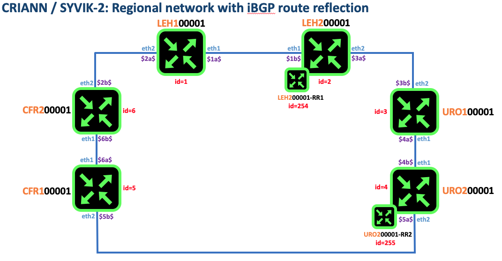

# Metropolitan Area Network use case [bgp-rr]

## BGP with route reflector config

```
cd validated-design/000-man/004a-run-bgp-rr
java -jar ../../rtr.jar test tester criann path ./ tmppath ./ wait
```
From that point you should have a running lab as depicted in the diagram below. This lab inherit from [isis-ldp](../003b-run-isis-ldp)
In the present lab, we will enable BGP on top of ISIS and MPLS-LDP

## Diagram


## Assumptions

### VDC definition
As BGP route reflection is a pure control plane set-up. It is a good opportunity to take advantage of freeRtr Virtual Device Context property. In the topology:

 * leh200001 (id=2) will host `rr1`
 * uro200001 (id=4) will hots `rr2`

 * On `leh20001`

```
vdc definition rr1
 local ethernet666
 exit
```

 * On `uro20001`

```
vdc definition rr1
 local ethernet666
 exit
```

> When VDC s created for the fisrt time, it will be effective only:

   After having issue `wr` on `leh20001` and `uro20001`
   
   The command above will require a warm reboot of `leh20001` and `uro20001`

 * Example
```
leh200001#conf t
leh200001(cfg)#vdc definition rr1
leh200001(cfg-vdc)#local ethernet 666
leh200001(cfg-vdc)#do wr
leh200001(cfg-vdc)#exit
leh200001(cfg)#wr
leh200001(cfg)#exit
leh200001#reload warm
```

### RR redundancy
It is a best practice to implement in a iBGP domain route reflector redundancy, hence `rr1` and `rr2`. In this case we will create a VDC for `leh200001-rr1` and `uro200001-rr2`


### BGP template
In this example we also demonstrate the capability to simplify configuration by using BGP template at the RR level combined with access-list in order to match the BGP peer. For simplicity's sake we used 10.0.0.0/28 and fd00:200:971::0/124


## Verification


* leh100001

```
leh100001#show ipv4 bgp 1 summary
neighbor    as      ready  learn  sent  uptime
10.0.0.254  200971  true   24     6     02:26:36
10.0.0.255  200971  true   24     6     02:26:36

leh100001#show ipv6 bgp 1 summary
neighbor          as      ready  learn  sent  uptime
fd00:200:971::fe  200971  true   28     6     02:26:41
fd00:200:971::ff  200971  true   28     6     02:26:41
```

* leh200001

```
leh200001#show ipv4 bgp 1 summary
neighbor    as      ready  learn  sent  uptime
10.0.0.254  200971  true   28     8     02:27:34
10.0.0.255  200971  true   26     8     02:27:34

leh200001#show ipv6 bgp 1 summary
neighbor          as      ready  learn  sent  uptime
fd00:200:971::fe  200971  true   24     8     02:27:38
fd00:200:971::ff  200971  true   22     8     02:27:38

```

* leh200001-rr1

```
❯ telnet 127.1  20002
Trying 127.0.0.1...
Connected to localhost.
Escape character is '^]'.
welcome
line ready
leh200001#attach vdc rr1

leh200001-rr1#
leh200001-rr1#show ipv4 bgp 1 summary
neighbor  as      ready  learn  sent  uptime
10.0.0.1  200971  true   6      30    02:31:38
10.0.0.2  200971  true   8      30    02:31:38
10.0.0.3  200971  true   6      30    02:31:38
10.0.0.4  200971  true   8      30    02:31:38
10.0.0.5  200971  true   6      30    02:31:38
10.0.0.6  200971  true   6      30    02:31:38

leh200001-rr1#show ipv6 bgp 1 summary
neighbor         as      ready  learn  sent  uptime
fd00:200:971::1  200971  true   6      30    02:31:43
fd00:200:971::2  200971  true   8      30    02:31:43
fd00:200:971::3  200971  true   6      30    02:31:43
fd00:200:971::4  200971  true   8      30    02:31:43
fd00:200:971::5  200971  true   6      30    02:31:43
fd00:200:971::6  200971  true   6      30    02:31:43

leh200001-rr1# [ Exit with shortcut: Ctrl-c -> Ctrl-x]
connection closed
leh200001-rr1#
```

* uro100001

```
uro100001#show ipv4 bgp 1 summary
neighbor    as      ready  learn  sent  uptime
10.0.0.254  200971  true   24     6     02:28:06
10.0.0.255  200971  true   24     6     02:28:06

uro100001#show ipv6 bgp 1 summary
neighbor          as      ready  learn  sent  uptime
fd00:200:971::fe  200971  true   28     6     02:28:10
fd00:200:971::ff  200971  true   28     6     02:28:10
```


* uro200001

```
uro200001#show ipv4 bgp 1 summary
neighbor    as      ready  learn  sent  uptime
10.0.0.254  200971  true   26     8     02:28:37
10.0.0.255  200971  true   28     8     02:28:37

uro200001#show ipv6 bgp 1 summary
neighbor          as      ready  learn  sent  uptime
fd00:200:971::fe  200971  true   22     8     02:28:41
fd00:200:971::ff  200971  true   24     8     02:28:41
```

* leh200001-rr2

```
❯ telnet 127.1  20004
Trying 127.0.0.1...
Connected to localhost.
Escape character is '^]'.
welcome
line ready
uro200001#attach vdc rr2

uro200001-rr2#
uro200001-rr2#show ipv4 bgp 1 summary
neighbor  as      ready  learn  sent  uptime
10.0.0.1  200971  true   6      30    02:33:28
10.0.0.2  200971  true   8      30    02:33:28
10.0.0.3  200971  true   6      30    02:33:28
10.0.0.4  200971  true   8      30    02:33:28
10.0.0.5  200971  true   6      30    02:33:28
10.0.0.6  200971  true   6      30    02:33:28

uro200001-rr2#show ipv6 bgp 1 summary
neighbor         as      ready  learn  sent  uptime
fd00:200:971::1  200971  true   6      30    02:33:35
fd00:200:971::2  200971  true   8      30    02:33:35
fd00:200:971::3  200971  true   6      30    02:33:35
fd00:200:971::4  200971  true   8      30    02:33:35
fd00:200:971::5  200971  true   6      30    02:33:35
fd00:200:971::6  200971  true   6      30    02:33:35

uro200001-rr2# [Exit with shortcut: Ctrl-c -> Ctrl-x]
connection closed
uro200001#
```

* cfr100001

```
cfr100001#show ipv4 bgp 1 summary
neighbor    as      ready  learn  sent  uptime
10.0.0.254  200971  true   24     6     02:29:06
10.0.0.255  200971  true   24     6     02:29:06

cfr100001#show ipv6 bgp 1 summary
neighbor          as      ready  learn  sent  uptime
fd00:200:971::fe  200971  true   28     6     02:29:10
fd00:200:971::ff  200971  true   28     6     02:29:10
```

* cfr200001

```
cfr200001#show ipv4 bgp 1 summary
neighbor    as      ready  learn  sent  uptime
10.0.0.254  200971  true   28     6     02:29:37
10.0.0.255  200971  true   28     6     02:29:37

cfr200001#show ipv6 bgp 1 summary
neighbor          as      ready  learn  sent  uptime
fd00:200:971::fe  200971  true   24     6     02:29:41
fd00:200:971::ff  200971  true   24     6     02:29:41
```


